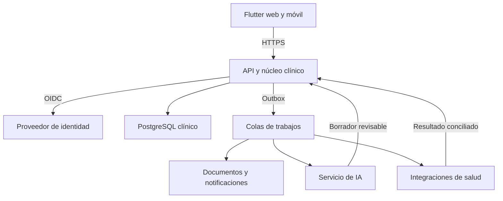

# Arquitectura de referencia

## Decisión de inicio

La plataforma tendrá un **núcleo clínico modular** y procesos independientes para cargas asíncronas e integración. Pacientes, agenda, atenciones y notas comparten transacciones y permanecen en `clinical-api`. Separar IA y conexiones externas permite que su indisponibilidad no impida documentar manualmente una consulta.

El núcleo no accede a implementaciones internas de otros módulos: expone servicios de aplicación y eventos. Spring Modulith verificará estos límites. La extracción posterior de un módulo será una decisión basada en carga, autonomía de despliegue y costo operativo.

## Componentes y momento de incorporación

| Componente | Responsabilidad | Tecnología | Inicio |
|---|---|---|---|
| `orbit_app` | Interfaz del personal de la IPS web/Android/iOS | Flutter, Dart, Riverpod, go_router | H0; iOS se verifica en H2 |
| `clinical-api` | API REST, autorización, núcleo clínico y sesión web BFF | Spring Boot, Java 21, Modulith | H0 |
| `identity` | Autenticación, MFA y sesiones de identidad | Keycloak OIDC | H0 |
| `postgres` | Datos transaccionales y versiones de documentos | PostgreSQL y Flyway | H0 |
| `redis` | Sesión del BFF y datos efímeros controlados | Redis | H0 |
| `clinical-worker` | Notificaciones y documentos, como manejadores separados | Java/Spring Boot | H2 |
| `ai-service` | Transcripción y borradores estructurados, API interna y worker | Python/FastAPI | H2 |
| `integration-worker` | Conectores de FEV/RIPS e IHCE/RDA y conciliación | Java/Spring Boot | H3 |
| `broker` | Entrega durable de trabajos y eventos | RabbitMQ | H2 |
| `object-storage` | Adjuntos, snapshots cifrados, audios temporales y exportaciones | Compatible S3 | H1 |

El BFF es inicialmente un módulo de `clinical-api`, no otro despliegue. El emisor de eventos de outbox también vive en el núcleo. Documentos y notificaciones pueden compartir un proceso worker sin convertirse en servicios por cada entidad. Keycloak es un producto operado, no un microservicio de contraseñas que debamos construir.

Las flechas de resultado representan contratos internos/eventos, nunca escritura directa en tablas clínicas. Redis, archivos y proxy HTTPS se omiten del diagrama para concentrarlo en los límites de responsabilidad.

## Módulos del núcleo

| Módulo | Propietario de |
|---|---|
| `organizations` | IPS, sedes, membresías y configuración |
| `patients` | Identificación, contactos, responsables y conciliación de duplicados |
| `scheduling` | Profesionales, disponibilidades y citas |
| `encounters` | Admisión, atención y transición de estados |
| `clinicalrecords` | Notas, versiones, confirmaciones y adendas |
| `forms` | Plantillas versionadas y respuestas |
| `clinicalcatalogs` | Diagnósticos, procedimientos, unidades y referencias versionadas |
| `billing` | Borrador de cuenta, factura y su estado de negocio |
| `documents` | Metadatos, permisos y exportaciones |
| `audit` | Evidencia de acceso y cambios |
| `automation` | Solicitudes de IA, cuotas y vínculo con resultados |

## Estructura prevista del repositorio

| Ruta a crear | Contenido |
|---|---|
| `apps/orbit_app/` | Proyecto Flutter y pruebas de interfaz |
| `services/clinical-api/` | API y módulos de dominio |
| `services/clinical-worker/` | Manejadores de trabajos de documentos y comunicaciones |
| `services/ai-service/` | API interna, worker, proveedores y evaluaciones de IA |
| `services/integration-worker/` | Conectores de salud y conciliación |
| `contracts/openapi/` | Contrato HTTP canónico |
| `contracts/events/` | Esquemas JSON de comandos y eventos |
| `infra/compose/` | Perfiles locales y configuración reproducible |
| `tests/scenarios/` | Casos de negocio con datos sintéticos |
| `docs/adr/` | Decisiones y cambios de arquitectura |

Estas rutas describen la estructura que se creará; este paquete entrega únicamente los Markdown de planificación.

## Identidad y organizaciones

- Web: OIDC Authorization Code con state, nonce y PKCE, gestionado por el BFF. El navegador utiliza cookie de sesión `HttpOnly`, `Secure` y política `SameSite` compatible con el flujo; tokens quedan en servidor. Escrituras con cookie requieren CSRF y validación de origen.
- Móvil: navegador del sistema, Authorization Code con PKCE, cliente público sin secreto embebido, tokens en almacenamiento seguro del sistema operativo.
- Una cabecera `X-Organization-Id` selecciona el contexto. El backend comprueba membresía activa y permiso en **cada petición**; el valor enviado no concede acceso. Se valida también cada recurso relacionado.
- No usar una organización global mutable para todas las pestañas. La app mantiene contexto por sesión de trabajo y vacía sus estados al cambiar; los trabajos guardan el contexto autorizado al crearse.
- El personal comercial no accede a historias clínicas. El administrador técnico no obtiene permisos asistenciales por ser administrador.

## Datos y transacciones

El núcleo es el único propietario de su base clínica. Los módulos usan interfaces de aplicación, no repositorios de otro módulo. Cada servicio independiente conserva su propia base lógica y credencial; pueden compartir servidor PostgreSQL en desarrollo, pero no tablas, conexiones privilegiadas ni consultas cruzadas.

La confirmación de una nota, su versión final, evidencia de auditoría y evento de salida se guardan en una transacción. El outbox se publica después. La mensajería se trata como entrega al menos una vez: cada consumidor deduplica y cada efecto de negocio es idempotente. No se promete procesamiento exactamente una vez.

## Decisiones adicionales

| Tema | Decisión inicial | Motivo |
|---|---|---|
| Modo de operación | En línea; borrador sin confirmar visible en memoria | Evitar conflictos clínicos y persistencia local inadvertida en la primera versión |
| API pública | REST/JSON versionada | Contrato común para web y móvil |
| Interoperabilidad | Adaptadores con los perfiles oficiales aplicables | Evitar acoplar tablas internas a un formato externo |
| Firma de nota | Confirmación profesional identificada, inmutabilidad y adenda | El mecanismo jurídico de firma se valida en SEC-005; un hash aislado no equivale a firma certificada |
| Despliegue piloto | Contenedores y ambientes separados | Operación trazable con tamaño inicial acotado |
| Escalamiento | Medir primero; extracción de módulos mediante ADR | No crear un servicio distribuido por cada tabla |

Cambios relevantes en stack, límites, modo offline o proveedor de IA deben registrar alternativas, impacto en datos y criterio de aceptación en un ADR.
